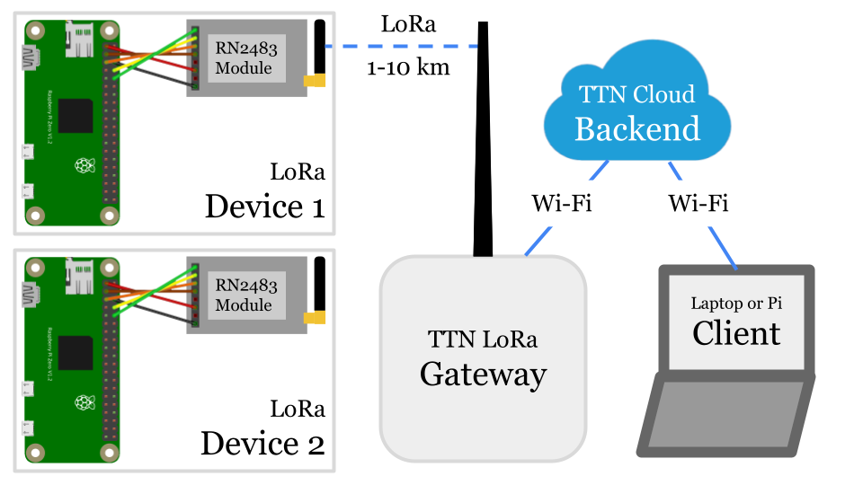
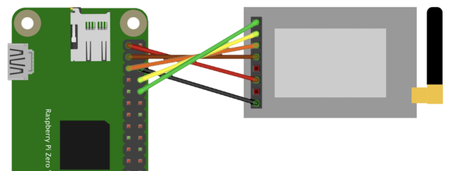

# Pi LoRa
Create a Raspberry Pi based LoRaWAN sensor.

Initiated by Michel of [Lug Limbe](https://sokolo.cronopios.org/) ([Map](https://www.openstreetmap.org/search?query=limbe%20linux#map=19/4.01908/9.17187)).

## Overview


One or more [Pi LoRa devices](#pi-lora-device-with-rn2483) send data packets to a [LoRa gateway](#pi-lora-gateway), using LoRa long range radio.

The LoRa gateway forwards received data packets to The Things Network (TTN), a [LoRa cloud backend](#configure-the-ttn-backend).

The [client computer](#python-ttn-client), an Internet-connected Pi or laptop, can get the data from the backend, if it is authorised.

# Pi LoRa device with RN2483
We use a Pi with a RN2483 LoRa module as our LoRaWAN device.

## Basic Pi Zero W setup
- Create an SD Card with [Pi Imager](https://www.raspberrypi.com/software/)
- Choose Pi OS Lite, 32-bit
- Create a User, e.g. pi
- Set Wi-Fi SSID, PW
- Enable SSH

## Get RN2483 hardware
* https://www.tindie.com/products/drazzy/lorawan-rn2483rn2903-breakout-board-assembled/ (RN2483)
* https://www.adafruit.com/product/1858 (Antenna)

## Wire the RN2483
Based on https://pinout.xyz/pinout/uart



Raspberry Pi|RN2483
:---|:---
RX|TX
TX|RX
RTS|CTS
CTS|RTS
-|(RST)
3V3|3V3
-|(NC)
GND|GND

## Install pip3
    $ sudo apt-get update
    $ sudo apt-get install python3-pip

## Install libraries
    $ pip3 install wiringpi

## Enable UART
    $ sudo nano /boot/config.txt
    enable_uart=1
    $ sudo raspi-config # > Interface Options > Serial Port > 
        Login shell ...: No > 
        Serial port ...: Yes
    $ sudo reboot

## Configure the TTN backend
This section shows the steps to configure the TheThingsNetwork (TTN) backend.

### Register as a TTN user (once)
- https://www.thethingsnetwork.org/

### Open the TTN console
- https://eu1.cloud.thethings.network/console/

### Create application
An application is needed per type of LoRaWAN device you want to connect, e.g. temperature sensor devices.

- Create App

### Register device
A separate device is needed for each physical LoRaWAN device you want to connect, e.g. sensor-1 and sensor-2.

- End devices
- Add end device
- Try manual device registration
- Frequency plan: Europe (recommended)
- LoRaWAN Version: 1.0.3
- Show advanced activation
- Activation by personalisation (ABP)
- Device Address: click icon to generate
- AppSKey: click icon to generate
- NwkSKey: click icon to generate
- End device ID: pi-lora-device-0
- Register end device

### Allow frame counter reset
- General settings
- Network layer > Expand
- Advanced MAC settings
- Reset frame counter [x]
- Save changes

### Get ABP keys
- Overview
- Device Address (This is your TTN_DEV_ADDR, required below)
- AppSKey: click icon to show key (This is your TTN_NWK_S_KEY)
- NwkSKey: click icon to show key (This is your TTN_APP_S_KEY)

## Download code
    $ wget https://raw.githubusercontent.com/tamberg/pi-lora/main/rn2483.py
    $ cat rn2483.py

## Set keys in code
[Get ABP keys](#get-abp-keys) from TTN console.

    $ nano rn2483.py
    TTN_DEV_ADDR = "00000000" # TODO
    TTN_NWK_S_KEY = "00000000000000000000000000000000" # TODO
    TTN_APP_S_KEY = "00000000000000000000000000000000" # TODO

## Run code
    $ python3 rn2483.py

The output should look something like this
```
sys get ver
RN2483 1.0.1 Dec 15 2015 09:38:09
sys get hweui
0000000000000000
mac reset 868
ok
mac set nwkskey 00000000000000000000000000000000
ok
mac set appskey 00000000000000000000000000000000
ok
mac set devaddr 00000000
ok
mac set adr off
ok
mac set ar off
ok
mac set pwridx 1
ok
mac set dr 5
ok
mac save
ok
mac join abp
ok
accepted
mac tx uncnf 1 000000000000000000000000000000000000
ok
mac_tx_ok
```

Check the [TTN console](https://eu1.cloud.thethings.network/console/) to see data packets sent by your device.

## Install service
Install a service to run _rn2483.py_ whenever the Pi is plugged in.

### Create service
```
$ sudo nano /lib/systemd/system/rn2483.service 
```

```
[Unit]
Description=RN2483 Pi LoRa service
Requires=dev-serial0.device
After=dev-serial0.device

[Service]
User=pi
WorkingDirectory=/home/pi
ExecStart=/usr/bin/python3 rn2483.py
Restart=on-failure

[Install]
WantedBy=multi-user.target
```
### Start service
```
$ sudo systemctl daemon-reload
$ sudo systemctl enable rn2483.service
$ sudo systemctl start rn2483.service
```

### Check service
```
$ ps aux | grep rn2483
pi         295  0.4  1.5  14372  6848 ?        Ss   09:07   0:04 /usr/bin/python3 rn2483.py
```

### Stop service (optional)
```
$ sudo systemctl stop rn2483.service
```

### Remove service (optional)
```
$ sudo rm /etc/systemd/system/multi-user.target.wants/rn2483.service
$ sudo rm /lib/systemd/system/rn2483.service
```

## Build enclosure
E.g. using an [AP9 junction box](https://new.abb.com/products/2TKA140012G1/ap9) and this [laser-cut adapter](./ap9-adapter.svg):


## Add sensor
E.g. a PIR sensor, use [pir.py](./pir.py) to test it, then try to run [rn2483-pir.py](./rn2483-pir.py).

Create a AP9 cover matching the sensor, e.g. this [laser-cut cover](./ap9-cover-pir.svg).


# Python TTN client
This Python program can run on a Pi or any other computer.

## Install libraries
    $ pip3 install paho-mqtt
    $ pip3 install pybase64

## Download code
    $ wget https://raw.githubusercontent.com/tamberg/pi-lora/main/ttn-client.py
    $ cat ttn-client.py

## Set keys in code
See TTN console.

    $ nano ttn-client.py
    TTN_APP_ID = "..." # TODO, e.g. pi-lora-app
    TTN_DEVICE_ID = "..." # TODO, e.g. pi-lora-device
    TTN_APP_API_KEY = "..." # TODO, see Integrations > MQTT

## Run code
    $ python3 ttn-client

That's it! Data packets sent from your [Pi LoRa device](#pi-lora-device-with-rn2483) are now received by the client.

# Pi LoRa Gateway
To run the Pi LoRa gateway, set up a Wi-Fi network with matching SSID and password.

Then plug in the Pi LoRa gateway and put the antenna in an upright position.

Make sure to chose an elevated location to reach maximum range.

Done! (The remaining steps are for setup from scratch.)

## Get ic880a hardware
* https://shop.imst.de/wireless-modules/lora-products/8/ic880a-spi-lorawan-concentrator-868-mhz
* https://shop.imst.de/wireless-modules/accessories/20/u.fl-to-sma-pigtail-cable-for-ic880a-spi (Cable)
* https://shop.imst.de/wireless-modules/accessories/19/sma-antenna-for-ic880a-spi-wsa01-im880b-and-lite-gateway (Antenna)

## Build enclosure
E.g. an [AP10 junction box](https://new.abb.com/products/2TKA140002G1/ap10) and this [laser-cut adapter](https://www.thingiverse.com/thing:1665467).

## Enable SPI
    $ sudo raspi-config # enable SPI

## Setup TTN gateway
    $ git clone https://github.com/ttn-zh/ic880a-gateway.git ~/ic880a-gateway
    $ cd ~/ic880a-gateway
    $ sudo ./install.sh spi

## Show config
    $ cat /opt/ttn-gateway/global_conf.json

## Show log
    $ sudo journalctl -u ttn-gateway --since="1h ago"

# Resources
## LoRaWAN with TTN
- http://www.tamberg.org/fhnw/2021/hs/IoT08LoRaWANConnectivity.pdf
- http://www.tamberg.org/fhnw/2021/hs/IoT09Dashboards.pdf
## Raspberry Pi Zero W Setup
- https://github.com/tamberg/fhnw-iot/wiki/Raspberry-Pi-Zero-W
## Raspberry Pi UART
- https://pinout.xyz/pinout/uart
- https://github.com/raspberrypi/documentation/blob/develop/documentation/asciidoc/computers/configuration/uart.adoc
## RN2483
- https://github.com/rac2030/MakeZurich/wiki/Using-the-Microchip-RN2483-via-Serial-to-USB
- https://ww1.microchip.com/downloads/en/DeviceDoc/RN2483-Data-Sheet-DS50002346E.pdf
## Gateway
- https://github.com/ttn-zh/ic880a-gateway/tree/spi
## Frequencies
- https://www.thethingsnetwork.org/docs/lorawan/frequencies-by-country/
- https://www.thethingsnetwork.org/docs/lorawan/regional-parameters/
